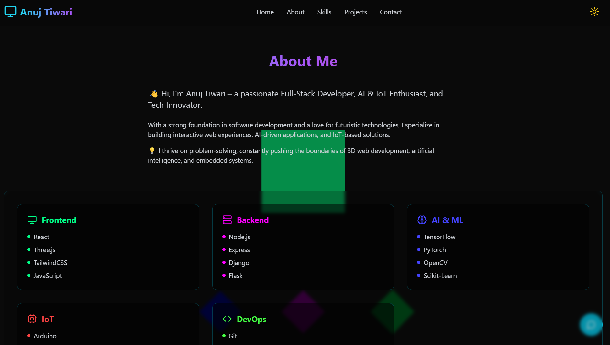

# 🚀 Portfolio Website

## 🌟 About the Project

This is my personal portfolio website showcasing my projects, skills, and experience. Built with modern web technologies, it provides a clean and interactive user experience.

## 🌍 Live Demo
🔗 **[Visit My Portfolio](https://anuj-portfolio-5018a.web.app/)**  

## ✨ Features

- Responsive and mobile-friendly design 📱
- Interactive UI with animations 🎨
- Dynamic project showcase 🏆
- Contact form for inquiries 📩
- SEO optimized for better visibility 🔍

## 🛠️ Tech Stack

### **Frontend**
- HTML, CSS, JavaScript
- TypeScript
- React.js
- Tailwind CSS

### **Backend**
- Node.js
- Express.js

### **Deployment & Tools**
- GitHub Pages (Version Control)
- Firebase Hosting (Deployment)
- Git & GitHub CLI
- Vite (Development Server)

## 🔧 Installation & Setup

To set up and run the project locally, follow these steps:

1. **Clone the repository**  
   
   git clone https://github.com/ANUJSELF/portfolio.git

2. **Navigate into the Project Directory**
    
    cd portfolio

3. **Install Dependencies**
    
    npm install

4. **Start the development server**
    
    npm run dev

## 🚀 Deployment

### GitHub Pages

1. **Push the code to GitHub**  
   
- git add .
- git commit -m "Initial commit"
- git push origin main

3. **Visit the GitHub repository settings and enable GitHub Pages.**

### Firebase Hosting

1. **Login to Firebase**  
   
   firebase login

2. **Initialize Firebase in the project**
    
    firebase init

3. **Deploy the site**
    
    firebase deploy

## 📬 Contact

### For any inquiries or collaborations, feel free to connect with me on:

- Portfolio: https://anuj-portfolio-5018a.web.app/
- GitHub: https://github.com/ANUJSELF
- Email: anujtiwari.kr@gmail.com
